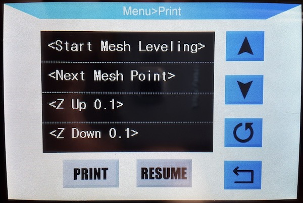
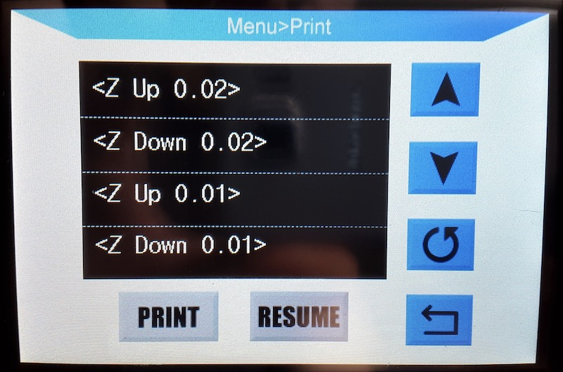
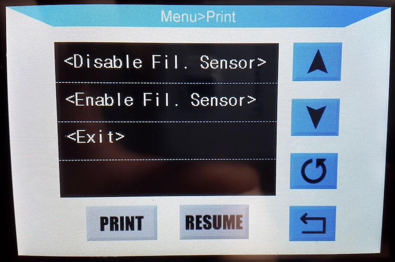

# Knutwurst's i3 MEGA S Firmware (based on Marlin 2.0.5.3)

(BITTE GENAU DURCHLESEN! / PLEASE READ CAREFULLY!)

## Readme - German (english below)

Diese Firmwarekonfiguration aktiviert viele neue erweitere Funktionen der Marlin Firmware:

 * Mesh-Bed Kalibrierung
 * S-Kurven Beschleunigung
 * "Juction Deviation" statt des klassischen "Jerk" 
 * "Linear Advance" aktiviert (kann mit M900 konfiguriert werden)
 * Babystepping während des Druckvorgangs
 * Bilinear Bed Leveling (BBL)
 * Manuelles Editieren der Messpunkte
 * Volle Anycubic Touchscreen Unterstützung
 * Spannung vom Bauteillüfter von 8V auf 12V
 * Pause & Filamentwechselfunktion
 * Automatische EEPROM Initialisierung
 * Filament Runout Sensor kann im Menü deaktiviert werden
 * Wiederaufnahme des Drucks nach Stromausfall (WiP)

Besser im Vergleich zu anderen Firmwares (Bugfixes):
 * Aufgeräumtes Special-Menü
 * Drucker hängt sich nicht auf, wenn man Dateien mit Sonderzeichen (Umlaute, Chinesisch etc.) auf der SD Karte hat
 * Kein dummes "wackeln" der Düse nach Stoppen eines Druckvorgangs
 * Kein Abstürzen bei zu vielen Dateien auf der SD Karte
 * Kein Abstürzen bei SD-Karten über 16 GB
 * Fehler "Melodie" bei Thermal Runaway Protection
 * Kein Aufhängen, wenn SD Karte + USB gleichzeitig genutzt wird
 * Kein Aufhängen wenn man Pause drückt
 * Kein Aufhängen, wenn das Filament leer ist.

Bekannte Bugs:
 * Filament Runout Sensor wird bei jedem Neustart wieder aktiviert
 * Wiederaufnahme nach Stromausfall funktioniert nur sehr unzuverlässig

---

### FAQ:

>Knutwurst, wieso machst du auch noch so eine Firmware? Es gibt doch schon so viele?

Weil ich bisher keine gesehen habe, die nicht die blöden Bugs enthält, wie z.B. dass sie abstürzt, wenn man Dateien mit Sonderzeichen auf der SD Karte hat.

>Wieso ist mein Drucker plötzlich lauter als vorher?

Dein Bauteillüfter läuft jetzt mit voller Drehzahl, was er vorher nicht tat. Stelle im Slicer (z.B. Cura) die Geschwindigkeit einfach auf 70% und schon hast du die alte Lautstärke wieder. Diese Modifikation ist notwendig, falls man den Lüfter tauschen möchte und viele Lüfter mit den originalen 8V nicht oder nur unzureichend laufen.

>Ist deine Firmware besser als andere?

Nein. Aber sicher auch nicht schlechter.

>Wo sind die Downloads?

Weiter unten.

>Muss ich bei TMC Treibern die Stecker drehen?

Nö. Lade dir einfach die korrekte Version herunter.

>Welche TMC Motortreiber sollte ich kaufen? Lieber die V2 oder die Bigtreetech V3?

Weder noch! Es gibt keine "V2" oder "V3". Die offizielle letzte Version von Trinamic ist v1.2 und die beiden großen priämären Hersteller für die echten SilentStepSticks sind FYSTEC und WATTERROTT. Lass bloß die Finger von Bigtreetech.

>Ich habe die Stecker bei meinen Motoren schon gedreht, als ich die TMC Treiber eingebaut habe. Muss ich jetzt trotzdem die TMC Version flashen?

Nein. Benutze einfach die Nicht-TMC Version, da sonst die Motoren wieder in die falsche Richtung laufen.

>Als ich die Treiber eingebaut habe, qualmte mein Mainboard in der Mitte rechts. Ist das normal?

Nein. Du hast die Treiber falsch herum eingebaut. Jetzt ist die Z-Diode (733A) verbrannt. Tausche sie aus und alles funktioniert wieder. Deine falsch gesteckten Treiber kannst du aber vermutlich wegschmeißen.

>Muss ich wie bei anderen Firmwares noch die E-Steps einstellen, wenn ich einen Mega S besitze?

Nein, lade dir einfach die korrekte Version herunter. Trotzdem solltest du die Steps noch kalibrieren.

---

### Bilder

---

### Download

Du kannst die fertigen Binärdateien hier herunterladen: https://github.com/knutwurst/Marlin-2-0-x-Anycubic-i3-MEGA-S/releases. Natürlich kannst du die Firmware mit PlatformIO oder der Arduino IDE auch selbst kompilieren.

-> `i3_Mega.hex` ist für den unmodifizierten originalen Anycubic i3 MEGA (ohne S).

-> `i3_Mega_TMC.hex` hat Optimierungen und invertierte Ausgänge für TMC2100 and TMC2208 Motortreiber.

-> `i3_Mega_S.hex` wird verwendet, wenn du den neuere "S" Version mit Titan-Extruder verwendest.

-> `i3_Mega_S_TMC.hex` benutzt du, wenn du sowohl die "S" Version mit Titan-Extruder und TMC Motortreiber verwendest.

---

## Readme - English

This firmware configuration activates many new features of the Marlin firmware:

 * Mesh bed calibration
 * S-curve acceleration
 * "Juction Deviation" instead of the classic "Jerk"
 * "Linear Advance" enabled (can be configured with M900)
 * Baby stepping during printing
 * Bilinear Bed Leveling (BBL)
 * Manual editing of the measuring points
 * Full Anycubic touchscreen support
 * Pause & filament change function
 * Automatic EEPROM initialization
 * Filament Runout Sensor can be deactivated in the menu
 * Power outage support

What's better in coparison to other firmwares (bug fixes):
 * Tidy special menu
 * Printer does not freeze if you have files with special characters (umlauts, Chinese..) on your SD card
 * No stupid "wobble" of the nozzle after stopping printing
 * No firmware crash when there are too many files on the SD card
 * No crash with SD cards over 16 GB
 * Acoustic alarm in case of a thermal runaway
 * No freezing when SD card + USB is used at the same time
 * No freezing when you press pause and try to resume
 * No freezing when the filament is empty

Known bugs:
 * Filament Runout Sensor is reactivated with every reboot
 * Power outage support does not work reliably

---

### FAQ:

> Knutwurst, why are you still doing such a firmware? Aren't there already so many?

Because I've never seen one that doesn't contain the stupid bugs like the crashes when you have files with special characters on the SD card.

>Why is my printer so much louder than before?

Your component fan is now running at full speed, which it did no before. Simply set the speed to 70% in the slicer (e.g. Cura) and you will have the old speed again. This modification is necessary if you want to replace the fan. Many aftermarket fans do not run properly or at all with the original 8V.

> Is your firmware better than others?

No. But certainly not worse either.

> Where are the downloads?

Further down.

> Do I have to turn the plugs for TMC drivers?

Nope, just download the correct version.

> Which TMC motor drivers should I buy? The V2 or the Bigtreetech V3?

Neither! There is no "V2" or "V3". The official last version of Trinamic is v1.2 and the two major primary manufacturers for the real SilentStepSticks are FYSTEC and WATTERROTT. Just stay away from Bigtreetech.

> I already turned the plugs on my motors when I installed the TMC drivers. Do I still have to flash the TMC version?

No. Just use the non-TMC version, otherwise the motors will turn in the wrong direction again.

> When I installed the drivers, my mainboard gave me the "magic smoke". Is that normal?

No. You installed the drivers the wrong way round. Now the Zener diode (733A) is burned. Exchange it and everything works again. You can probably throw away your wrongly inserted drivers.

> As with other firmwares, do I still have to set the E-Steps if I have a Mega S?

No, just download the correct version. Nevertheless, you should still calibrate the e-steps.

---

### Pictures

---

### Download

You can download the precompiled binary files from here: https://github.com/knutwurst/Marlin-2-0-x-Anycubic-i3-MEGA-S/releases. Of course you can also compile the firmware yourself with PlatformIO or the Arduino IDE.

-> `i3_Mega.hex` is for the unmodified original Anycubic i3 MEGA (without S).

-> `i3_Mega_TMC.hex` has optimizations and inverted outputs for TMC2100 and TMC2208 motor drivers.

-> `i3_Mega_S.hex` is used if you use the newer "S" version with titan extruder.

-> `i3_Mega_S_TMC.hex` you use if you use both the "S" version with titan extruder and TMC motor driver.

