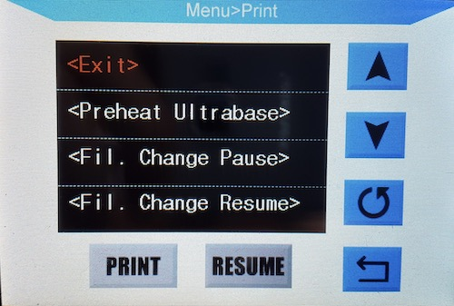
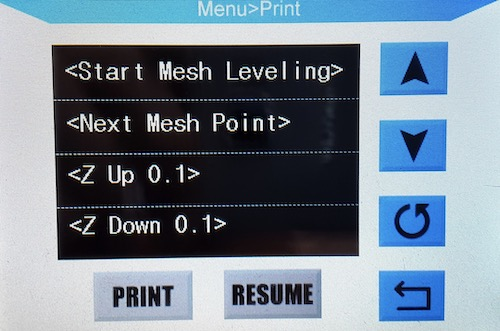
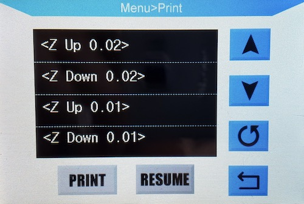
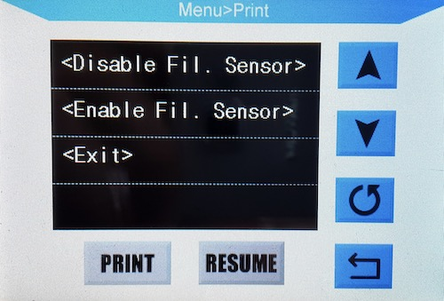
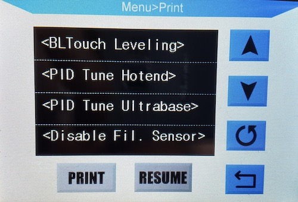
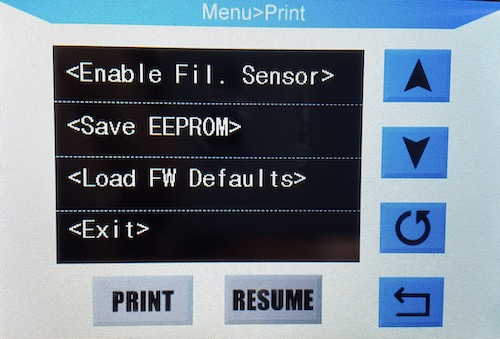

# Knutwurst's i3 MEGA (S/X) Firmware (based on Marlin 2.0.5.4)

(BITTE GENAU DURCHLESEN! / PLEASE READ CAREFULLY!)

### Wenn dir gefällt, was ich mache, kannst du mir hier einen Kaffee spendieren*: 
*Es muss jetzt keine großzügige Spende sein. Ein paar Cent reichen um mir zu zeigen, wer überhaupt Interesse daran hat und wem die Weiterentwicklung wichtig ist. So bleibt die Motivation da und ich weiß einfach, dass ich nicht für die Tonne programmiere ;)

### Wenn du Fragen hast, schaue gern in der offiziellen [Facebook-Gruppe](https://www.facebook.com/groups/3094090037303577/) vorbei.

# Inhaltsverzeichnis (Deutsch)
- [Funktionen](#funktionen)
   - [Was ist besser?](#besser-im-vergleich-zu-anderen-firmwares-bugfixes)
   - [Bekannte Bugs](#bekannte-bugs)
- [Häufig gestellte Fragen (FAQ)](#häufig-gesellte-fragen-faq)
- [Fotos / Bilder](#bilder)
   - [Spezial Menü](#special-menu)
   - [Manual Mesh Beld Leveling](#manuelles-leveln)
   - [BLTouch Beld Leveling](#automatisches-bltouch-leveln)
- [Downloads](#downloads)

# Table of Contets (english)
- [Features](#faq)
   - [What's better?](#faq)
   - [Known Bugs](#faq)
- [Frequently asked questions (FAQ)](#faq)
- [Photos / Pictures](#bilder)
   - [Special Menü](#special-menu)
   - [Manual Mesh Beld Leveling](#manual-mesh-beld-leveling)
   - [BLTouch Beld Leveling](#bltouch-beld-leveling)
- [Download](#download)

# Readme - German

## Funktionen

 * Mesh-Bed Kalibrierung / Autokalibrierung mit BLTouch (WiP)
 * S-Kurven Beschleunigung
 * "Juction Deviation" statt des klassischen "Jerk" 
 * "Linear Pressure Control v1.5" aktiviert (kann mit M900 konfiguriert werden)
 * Babystepping während des Druckvorgangs
 * Bilinear Bed Leveling (BBL)
 * Manuelles Editieren der Messpunkte
 * Volle Anycubic Touchscreen Unterstützung
 * Unterstützung des neuen Anycubic Touchscreens (DGUS II)
 * Bauteilkühler läuft nun auf 100% statt maximal 70%
 * Pause & Filamentwechselfunktion
 * Automatische EEPROM Initialisierung
 * Filament Runout Sensor kann im Menü deaktiviert werden
 * Wiederaufnahme des Drucks nach Stromausfall (WiP)
 * Druckbettgröße erweitert auf 220 x 225 x 210 mm
 * Automatischer 'Slowdown', falls Daten nicht schnell genug fließen

## Besser im Vergleich zu anderen Firmwares (Bugfixes):
 * Aufgeräumtes Special-Menü
 * Drucker hängt sich nicht auf, wenn man Dateien mit Sonderzeichen (Umlaute, Chinesisch etc.) auf der SD Karte hat
 * Kein dummes "wackeln" der Düse nach Stoppen eines Druckvorgangs
 * Kein Abstürzen bei zu vielen Dateien auf der SD Karte
 * Kein Abstürzen bei SD-Karten über 16 GB
 * Fehler "Melodie" bei Thermal Runaway Protection
 * Kein Aufhängen, wenn SD Karte + USB gleichzeitig genutzt wird
 * Kein Aufhängen wenn man Pause drückt
 * Kein Aufhängen, wenn das Filament leer ist.

## Bekannte Bugs:
 * Filament Runout Sensor wird bei jedem Neustart wieder aktiviert
 * Wiederaufnahme nach Stromausfall funktioniert nur sehr unzuverlässig

---

# Häufig gesellte Fragen (FAQ):

>Knutwurst, wieso machst du auch noch so eine Firmware? Es gibt doch schon so viele?

Weil ich bisher keine gesehen habe, die nicht die blöden Bugs enthält, wie z.B. dass sie abstürzt, wenn man Dateien mit Sonderzeichen auf der SD Karte hat.

>Ist es richtig, dass du mehr Wert auf den Druck von SD-Karte legst und andere eher auf USB?

ich lege nicht "mehr Wert auf SD", sondern habe einfach die zahlreichen Bugs dahingehend gefixed. Die kleinen Anpassungen mit dem USB Puffer etc sind sowieso drin. Die sind aber in meinen Augen so uninteressant, dass ich es nicht erwähne, denn das wirklich komplizierte ist es, das proprietäre Display und den Cardreader korrekt anzusteuern. Alles andere ist Pillepalle.

>Was ist dieser "Slowdown"?

Der automatische Slowdown wird aktiv, falls der Drucker nicht schnell genug Daten bekommt. Dann fährt er automatisch mit der Geschwindigkeit auf 50% runter, satt unbehelligt weiterzumachen und dann zu ruckeln und Blobs zu verursachen.

>Wieso ist mein Drucker plötzlich lauter als vorher?

Dein Bauteillüfter läuft jetzt mit voller Drehzahl, was er vorher nicht tat. Stelle im Slicer (z.B. Cura) die Geschwindigkeit einfach auf 70% und schon hast du die alte Lautstärke wieder. Diese Modifikation ist notwendig, falls man den Lüfter tauschen möchte und viele Lüfter mit den originalen 8V nicht oder nur unzureichend laufen.

>Ist deine Firmware besser als andere?

Nein. Aber sicher auch nicht schlechter.

>Wo sind die Downloads?

Weiter unten.

>Muss ich bei TMC Treibern die Stecker drehen?

Nö. Lade dir einfach die korrekte Version herunter.

>Welche TMC2208 Motortreiber sollte ich kaufen? Lieber die V2 oder die Bigtreetech V3?

Weder noch! Es gibt keine "V2" oder "V3". Die offizielle letzte Version von Trinamic ist v1.2 und die beiden großen primären Hersteller für die echten SilentStepSticks sind FYSETC und WATTERROTT. Lass bloß die Finger von Bigtreetech.

>Ich habe die Stecker bei meinen Motoren schon gedreht, als ich die TMC Treiber eingebaut habe. Muss ich jetzt trotzdem die TMC Version flashen?

Nein. Benutze einfach die Nicht-TMC Version, da sonst die Motoren wieder in die falsche Richtung laufen.

>Als ich die Treiber eingebaut habe, qualmte mein Mainboard in der Mitte rechts. Ist das normal?

Nein. Du hast die Treiber falsch herum eingebaut. Jetzt ist die Z-Diode (733A) verbrannt. Tausche sie aus und alles funktioniert wieder. Deine falsch gesteckten Treiber kannst du aber vermutlich wegschmeißen.

>Muss ich wie bei anderen Firmwares noch die E-Steps einstellen, wenn ich einen Mega S besitze?

Nein, lade dir einfach die korrekte Version herunter. Trotzdem solltest du die Steps noch kalibrieren.

>Wieso zeigt das Display keine Fehlermeldungen an und wieso sieht es noch genau so aus wie vorher?

Dein Mainboard (Trigorilla) kann nur Grafikdisplays wie das 2004 oder 12864 ansteuern. Auf denen würdest du auch exakt das sehen, was in der Firmware wirklich passiert - eben weil diese das anzeigen, was die Firmware sagt. Texte, Fehlermeldungen etc...

Bei deinem (und auch allen anderen) Touchdisplay sieht das anders aus. Das Touch-Display ist nur eine hübsche Aufmachung und übersetzt intern die eigentlichen Befehle in etwas, was das Mainboard versteht. Es ist bloß eine "Maske" für die eigentliche Firmware.

Es besteht ein 1-zu-1 Mapping zwischen den Befehlen, die das Mainboard umsetzen kann (Setze Temperatur auf Wert x, Bewege Motor um 10 mm nach rechts etc). Stellst du die Temperatur im Display auf 200°C ein, schickst du eigentlich nur einen Gcode wie z.B. "M104 T1 S200", was schon im Display vorhanden sein muss.

Bei diesem Mapping ist man eben darauf angewiesen, dass die Funktionen, die man nutzen will, auch im Display vorhanden sind. Und leider ist nicht viel drin. Die Dateiliste ist das einzige(!) über das man einigermaßen die Kontrolle hat, da sie dynamisch angezeigt wird. Leider muss man deswegen leider auch diese dämlichen Eigenarten in Kauf nehmen, wie die Tatsache, dass nach einem Bestätigen/Aktualisieren die Liste neu aufgebaut wird und somit oben beginnt.

---

# Bilder
## Spezial Menü

## Manuelles Leveln

## Automatisches BLTouch Leveln

---

# Downloads

Du kannst die fertigen Binärdateien hier herunterladen: https://github.com/knutwurst/Marlin-2-0-x-Anycubic-i3-MEGA-S/releases. Natürlich kannst du die Firmware mit PlatformIO oder der Arduino IDE auch selbst kompilieren.

-> `i3_Mega.hex` ist für den unmodifizierten originalen Anycubic i3 MEGA (ohne S).

-> `i3_Mega_TMC.hex` hat Optimierungen und invertierte Ausgänge für TMC2100 and TMC2208 Motortreiber.

-> `i3_Mega_S.hex` wird verwendet, wenn du den neuere "S" Version mit Titan-Extruder verwendest.

-> `i3_Mega_S_TMC.hex` benutzt du, wenn du sowohl die "S" Version mit Titan-Extruder und TMC Motortreiber verwendest.

-> `i3_Mega_S_DGUS.hex` wird verwendet, wenn du den neuere "S" Version mit Titan-Extruder und außerdem auch das neue Display in blau/gelb besitzt.

-> `i3_Mega_S_DGUS_TMC.hex` benutzt du, wenn du sowohl die "S" Version mit Titan-Extruder, neuem TFT in blau/gelb und TMC Motortreiber verwendest.

---

### If you like what I do you can buy me a coffee: 
*It doesn't have to be a generous donation. A few cents are enough to show me who is interested in further development. So the motivation stays and I just know that I am not programming for the bin ;)

# Readme - English

## Features:

 * Mesh bed calibration / Auto calibration with BLTouch (WiP)
 * S-curve acceleration
 * "Juction Deviation" instead of the classic "Jerk"
 * "Linear Pressure Control v1.5" enabled (can be configured with M900)
 * Baby stepping during printing
 * Bilinear Bed Leveling (BBL)
 * Manual editing of the measuring points
 * Full Anycubic touchscreen support
 * Support for the new Anycubic Touchscreen (DGUS II)
 * Part cooling fan now runs at 100% instead of 70%
 * Pause & filament change function
 * Automatic EEPROM initialization
 * Filament Runout Sensor can be deactivated in the menu
 * Power outage support
 * Print bed size enlarged to 220 x 225 x 210 mm
 * Automatic slowdown in if the data is not received fast enough

### What's better in coparison to other firmwares (bug fixes):
 * Tidy special menu
 * Printer does not freeze if you have files with special characters (umlauts, Chinese..) on your SD card
 * No stupid "wobble" of the nozzle after stopping printing
 * No firmware crash when there are too many files on the SD card
 * No crash with SD cards over 16 GB
 * Acoustic alarm in case of a thermal runaway
 * No freezing when SD card + USB is used at the same time
 * No freezing when you press pause and try to resume
 * No freezing when the filament is empty

### Known bugs:
 * Filament Runout Sensor is reactivated with every reboot
 * Power outage support does not work reliably

---

# FAQ:

> Knutwurst, why are you still doing such a firmware? Aren't there already so many?

Because I've never seen one that doesn't contain the stupid bugs like the crashes when you have files with special characters on the SD card.

> Is it correct that you put more emphasis on printing from SD card and others more on USB?

I don't put "more emphasis on SD", but just fixed the numerous bugs. The small adjustments with the USB buffer etc are included anyway. But they are so uninteresting in my eyes that I don't mention it, because the really complicated thing is to control the proprietary display and the card reader correctly. Everything else is easy-peasy.

> What is this "slowdown"?

The automatic slowdown is activated if the printer does not receive data quickly enough (e.g. via USB). Then it automatically goes down to 50%. This prevents stuttering and eliminated blobs.

>Why is my printer so much louder than before?

Your component fan is now running at full speed, which it did no before. Simply set the speed to 70% in the slicer (e.g. Cura) and you will have the old speed again. This modification is necessary if you want to replace the fan. Many aftermarket fans do not run properly or at all with the original 8V.

> Is your firmware better than others?

No. But certainly not worse either.

> Where are the downloads?

Further down.

> Do I have to turn the plugs for TMC drivers?

Nope, just download the correct version.

> Which TMC2208 motor drivers should I buy? The V2 or the Bigtreetech V3?

Neither! There is no "V2" or "V3". The official last version of Trinamic is v1.2 and the two major primary manufacturers for the real SilentStepSticks are FYSETC and WATTERROTT. Just stay away from Bigtreetech.

> I already turned the plugs on my motors when I installed the TMC drivers. Do I still have to flash the TMC version?

No. Just use the non-TMC version, otherwise the motors will turn in the wrong direction again.

> When I installed the drivers, my mainboard gave me the "magic smoke". Is that normal?

No. You installed the drivers the wrong way round. Now the Zener diode (733A) is burned. Exchange it and everything works again. You can probably throw away your wrongly inserted drivers.

> As with other firmwares, do I still have to set the E-Steps if I have a Mega S?

No, just download the correct version. Nevertheless, you should still calibrate the e-steps.

> Why doesn't the display show any error messages and why does it still look exactly as before?

Your mainboard (Trigorilla) can only control graphic displays like the 2004 or 12864. On them you would also see exactly what really happens in the firmware - to be precise, they show what the firmware says. Texts, error messages etc.

With your (and all other) touch displays, things look different. The touch display is just a pretty presentation and internally translates the actual commands into something that the motherboard understands. It is just a "mask" for the actual firmware.

There is a 1-to-1 mapping between the commands that the mainboard has implemented (set temperature to value x, move motor by 10 mm to the right, etc.). If you set the temperature in the display to 200°C, you actually only send a Gcode such as "M104 T1 S200", which must already be on the display firmware.

With this mapping, you have to rely on the fact that the functions you want to use are also available on the display. And unfortunately there is not much in it. The file list is the only thing(!) over which you have some control because it is displayed dynamically. Unfortunately, you have to accept these stupid idiosyncrasies, such as the fact that after confirming/updating the list is rebuilt and thus starts at the top.

---

# Pictures
##  Special Menu

## Manual Mesh Beld Leveling

## BLTouch Beld Leveling

---

# Download

You can download the precompiled binary files from here: https://github.com/knutwurst/Marlin-2-0-x-Anycubic-i3-MEGA-S/releases. Of course you can also compile the firmware yourself with PlatformIO or the Arduino IDE.

-> `i3_Mega.hex` is for the unmodified original Anycubic i3 MEGA (without S).

-> `i3_Mega_TMC.hex` has optimizations and inverted outputs for TMC2100 and TMC2208 motor drivers.

-> `i3_Mega_S.hex` is used if you use the newer "S" version with titan extruder.

-> `i3_Mega_S_TMC.hex` you use if you use both the "S" version with titan extruder and TMC motor driver.

-> `i3_Mega_S_DGUS.hex` is used if you use the newer "S" version with titan extruder and also the newer DGUS TFT with blue/yellow colors.

-> `i3_Mega_S_DGUS_TMC.hex` you use if you use the newest "S" version with titan extruder and TMC motor driver and also the new blue/yellow TFT.

